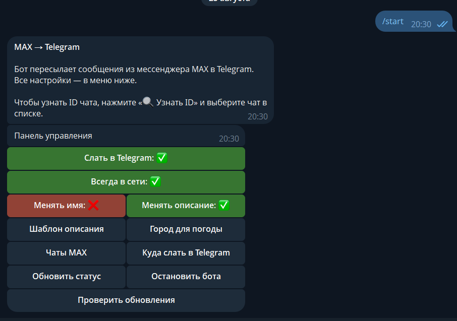
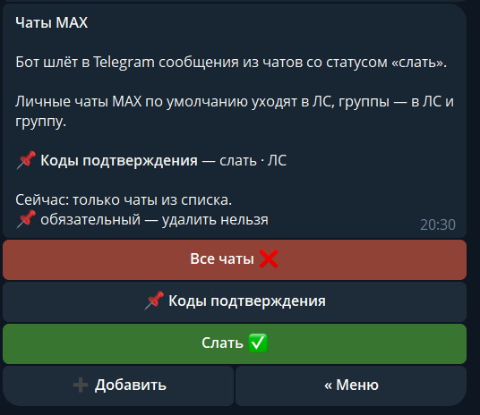
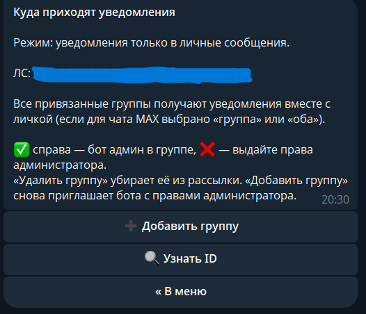

# MAX → Telegram

Пересылает сообщения из [MAX](https://web.max.ru) в Telegram.

## Важно: европейский VPS

**Запускайте бота на европейском сервере** (Финляндия, Германия, Нидерланды, Польша и т.п.).

На российских VPS часто блокируется `api.telegram.org`, а вход в MAX по телефону упирается в капчу. Европейский сервер обычно стабильнее для Telegram API и веб-входа MAX.

Бот работает только на вашем VPS, данные сохраняются в вашу локальную базу данных

Рекомендуемый провайдер: [play2go.cloud](https://play2go.cloud/?ref_id=k5jH0xQ4-_g)

DE-PROMO
119₽ / мес.

- Процессор: 1 vCPU AMD Ryzen 9 5950X
- Оперативная память: 2 GB DDR4
- Хранилище: 25 GB NVMe SSD
- Скорость сети: До 100 Mbit/s
- Защита от DDoS:Мощная защита от атак L3-L4

## Установка (VPS)

```bash
git clone https://github.com/romanich237/max_bot.git
cd max_bot
export NODE_OPTIONS=--dns-result-order=ipv4first
export TG_TOKEN='TOKEN'
export TG_CHAT_ID='ID'
bash install.sh
```

## Команды в Telegram

| Команда | Описание |
|---------|----------|
| `/menu` | Настройки|
| `/reauth` | Повторный вход|

Остальное — через кнопки в `/menu`: статус, старт/стоп MAX, чат уведомлений.

## Скриншоты
Меню управления

Откуда отправлять сообщения

Куда отправлять сообщения


## На сервере

```bash
pm2 logs max-tg
pm2 restart max-tg
```

## Если автообновление не выполняется, используйте:
```bash
cd ~/каталог
git fetch origin
git reset --hard origin/main
npm install
pm2 restart max-tg max-tg-update
```